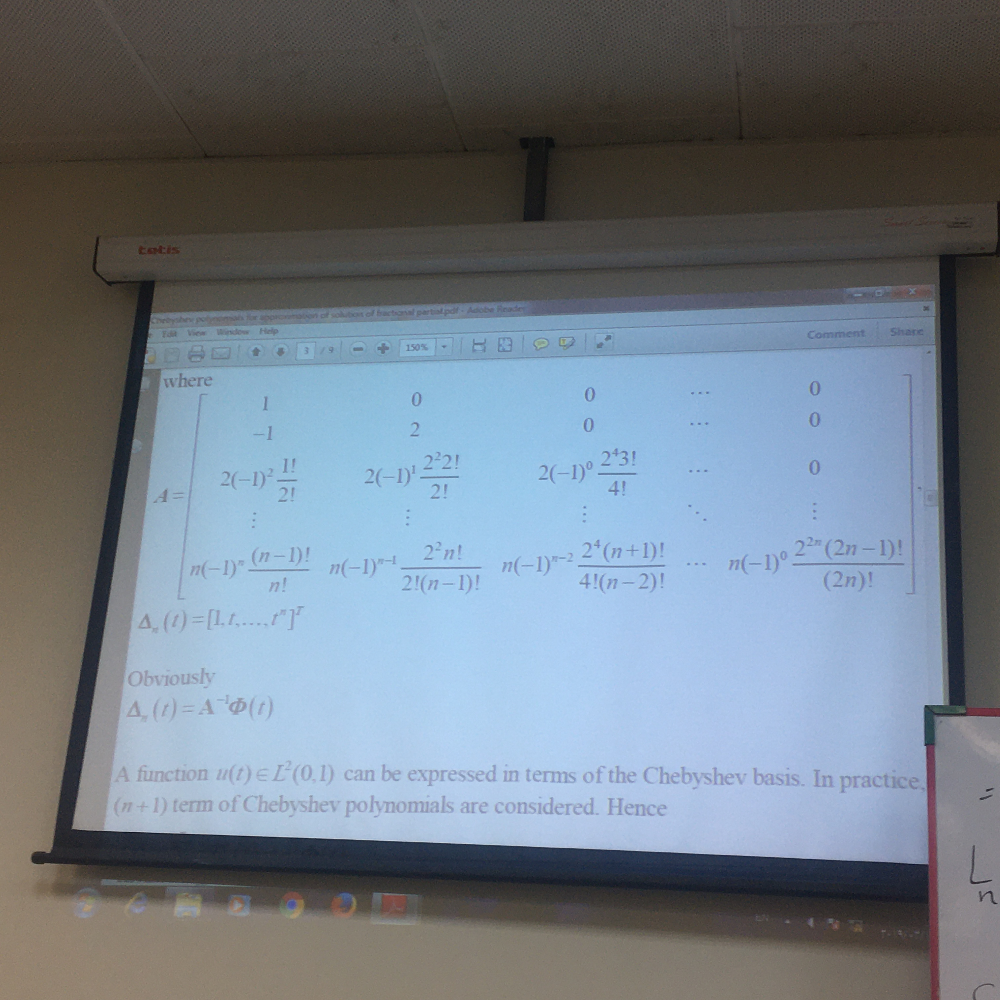
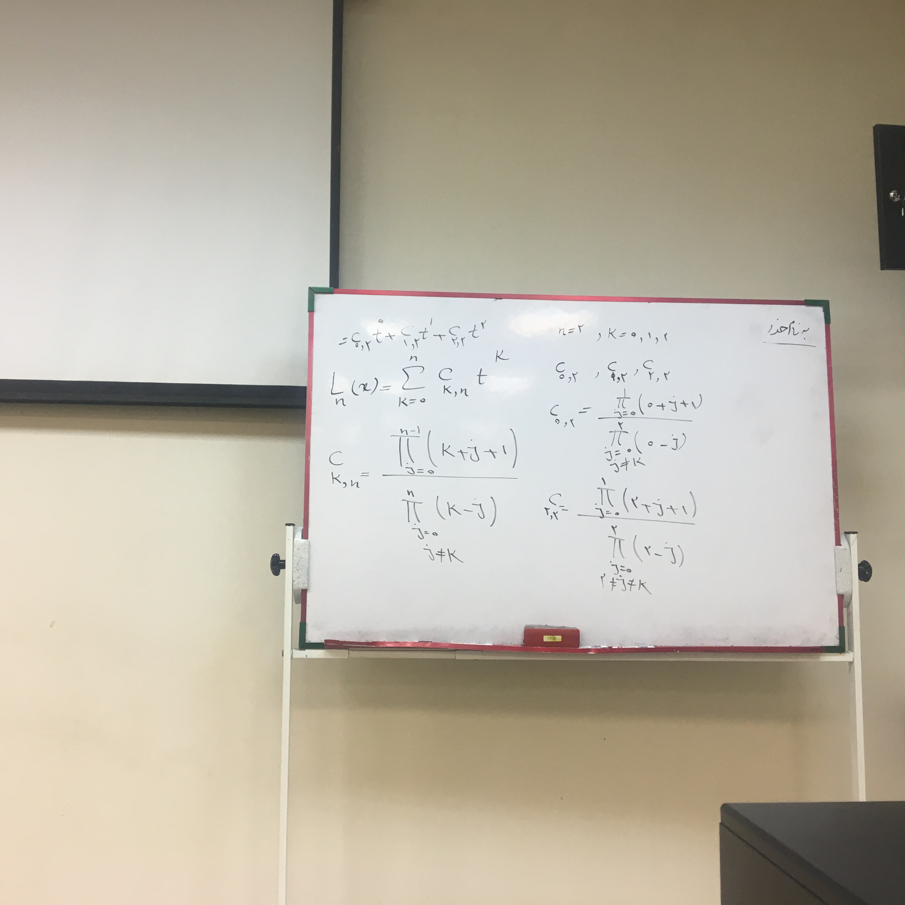

# Maple Programming

A repository to begin learning programming with Maple.

### Questions

This was explain in university:

#### Second question



```
size := 9;
result := Matrisize+1, size+1);
result[1, 1] := 1;
result[2, 1] := -1;
result[2, 2] := 2;
for row from 2 to size do
for column from 0 to size do
if row >= column then
prefix := row*(-1)^(row-column);
numerator := (2^(2*column))*(factorial(row-1+column));
denominator := (factorial(2*column))*(factorial(row-column));
result[row+1, column+1] := prefix*numerator/denominator;
end if;
end do;
end do;
result;
```

#### First question



```
size := 5;
x:= 2;
result := 0;
for k from 0 to size do
answer := 0;
r1 := 1;
for j1 from 0 to size-1 do
r1 := r1*(k+j1+1);
end do;
r2 := 1;
for j2 from 0 to size do
if j2 <> k then
r2 := r2*(k-j2);
end if;
end do;
answer := r1/r2;
result := result+answer*x^k;
end do;
result
```

```
n := 5;
sum(((product(k+j+1, j = 0 .. n-1))*x^k/((product(k-j, j = 0 .. k-1))*(product(k-j, j = k+1 .. n))))*x^k, k = 0 .. n); Sum(((Product(k+j+1, j = 0 .. n-1))*x^k/((Product(k-j, j = 0 .. k-1))*(Product(k-j, j = k+1 .. n))))*x^k, k = 0 .. n);
```

## Maple Language for Beginners

[Maple](http://www.maplesoft.com/products/maple/) is a high-level language and interactive environment for numerical computation, visualization, and programming. Using Maple, you can analyze data, develop algorithms, and create models and applications. The language, tools, and built-in math functions enable you to explore multiple approaches and reach a solution faster than with spreadsheets or traditional programming languages, such as C/C++ or Java.

# Maple

Maple is proprietary software produced by Maplesoft and requires a license to obtain, install, and activate. Arch is not officially supported, but the installer provided by Maplesoft may work in some cases.

---------

# Max Base

My nickname is Max, Programming language developer, Full-stack programmer. I love computer scientists, researchers, and compilers.

## Asrez Team

A team includes some programmer, developer, designer, researcher(s) especially Max Base.

[Asrez Team](https://www.asrez.com/)
